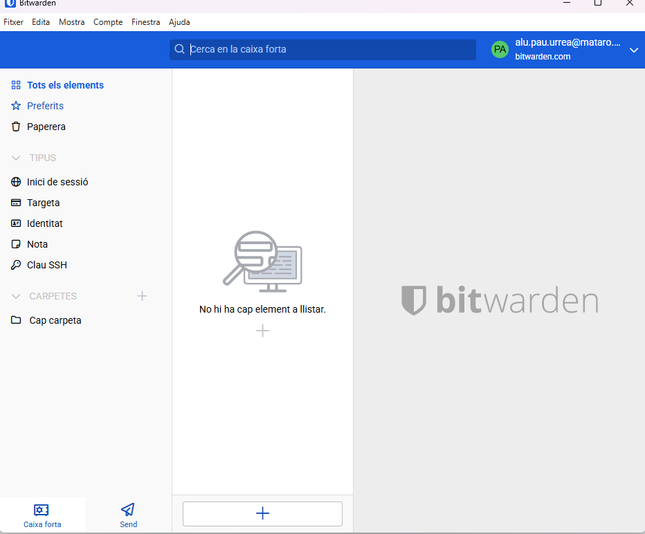
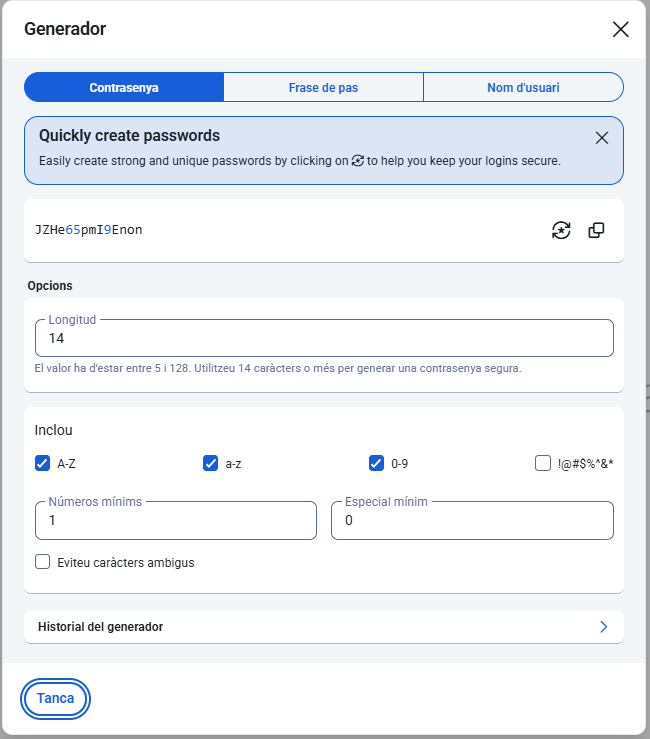

# **Fase 2: Guia d'Ús Tècnica – Bitwarden**  
### **Manual Operatiu per a l’Equip Tècnic**

---

## **1. Instal·lació i Configuració Inicial**

1. **Descàrrega de Bitwarden**  
   - Accedeix a [https://bitwarden.com/download/](https://bitwarden.com/download/)  
   - Selecciona la versió corresponent al teu sistema operatiu (Windows, macOS, Linux) o dispositiu mòbil (Android/iOS).  

2. **Instal·lació**  
   - Executa el fitxer descarregat i segueix les instruccions del instal·lador.  
   - Per navegadors, afegeix l’extensió oficial de Bitwarden des de Chrome Web Store o Firefox Add-ons.

3. **Creació de Compte Mestre**  
   - Obre l’aplicació i selecciona “Crear compte”.  
   - Introdueix un **correu electrònic corporatiu** i una **contrasenya mestra forta**.  
   - Recomanació: utilitza una contrasenya d’almenys 16 caràcters, combinant majúscules, minúscules, números i símbols.  

---

## **2. Generació de Contrasenyes Segures**

1. Obre l’aplicació o l’extensió del navegador.  
2. Selecciona **Generador de Contrasenyes**.  
3. Configura els paràmetres:  
   - Longitud: 16–32 caràcters recomanats.  
   - Inclou majúscules, minúscules, números i símbols.  
   - Evita caràcters amb confusió visual (`O` i `0`, `l` i `1`).  
4. Fes clic a **Generar** i copia la contrasenya a la targeta corresponent o a l’aplicació.  

---

## **3. Exemples d'Ús i Emplenament Automàtic**

### **3.1 Desar una credencial de correu electrònic**
1. Obre Bitwarden i selecciona **Afegir nou element**.  
2. Tipus: `Login`  
3. Introduir:  
   - Nom: “Correu Corporatiu”  
   - URL: `https://mail.empresa.com`  
   - Nom d’usuari: teu correu electrònic  
   - Contrasenya: generada amb el generador de Bitwarden  
4. Desa els canvis.

### **3.2 Desar una credencial d’una aplicació o servei web**
1. Segueix els mateixos passos que per al correu electrònic.  
2. Afegiu notes si cal informació addicional (claus API, PIN, etc.).  

### **3.3 Utilitzar l’extensió del navegador**
1. Accedeix al lloc web on vols iniciar sessió.  
2. Fes clic a l’icona de Bitwarden al navegador.  
3. Selecciona l’element corresponent i fes clic a **Autofill**.  
4. Bitwarden emplenarà automàticament nom d’usuari i contrasenya.

---

## **4. Gestió de Còpies de Seguretat (Backup)**

### **4.1 Exportar dades**
1. Obre Bitwarden Desktop o Web Vault.  
2. Ves a **Eines → Exportar Vault**.  
3. Introdueix la contrasenya mestra i copia l’arxiu exportat (JSON o CSV).  
   - **⚠️ Important:** L’arxiu exportat **no està xifrat** fora del vault, tractar amb precaució.  

### **4.2 Millor pràctica d’emmagatzematge**
- Emmagatzema la còpia en un **USB xifrat** o **núvol xifrat** (per exemple: VeraCrypt, BitLocker, Nextcloud amb xifratge).  
- Fes còpies periòdiques i comprova la seva integritat.  
- No comparteixis mai l’arxiu sense xifrar.  

---

## **5. Recomanacions Finals**
- Utilitza Bitwarden per a **totes les credencials corporatives**.  
- Activa **2FA (Autenticació de Dos Factors)** sempre que sigui possible.  
- Mantingues el vault actualitzat i fes còpies de seguretat regularment.  
- Educa els usuaris sobre la importància de **contrasenyes úniques i fortes**.

