# 🧩 T04: Serveis de Directori – LDAP

## 🛠️ 1. Instal·lació d’OpenLDAP

- La màquina tindrà **dues interfícies de xarxa**:
  - Una en **xarxa NAT**
  - Una altra en **host-only**

- Instal·lem el paquet **`ldap-utils`**:


- Durant la configuració, establim la **contrasenya del servei LDAP** (`p@ssw0rd`):

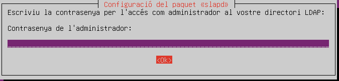

- Comprovem que el **servei LDAP s’està executant correctament**:

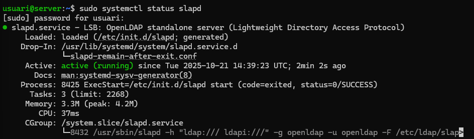

- Verifiquem que el **directori s’ha creat amb el nom correcte**:

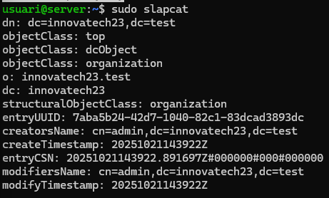

- Creem les **Unitats Organitzatives (OU)** per a *users* i *groups*:

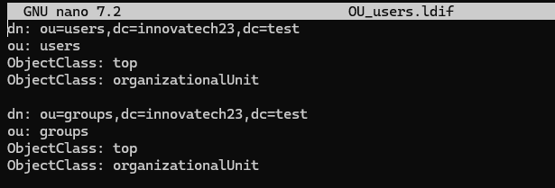

- Comprovem que s’han creat correctament:

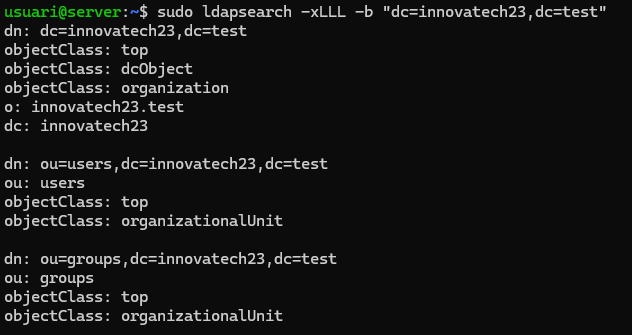

---

## ⚙️ 2. Configuració del directori amb LDAP Account Manager (LAM)

- Obrim el **LDAP Account Manager**:

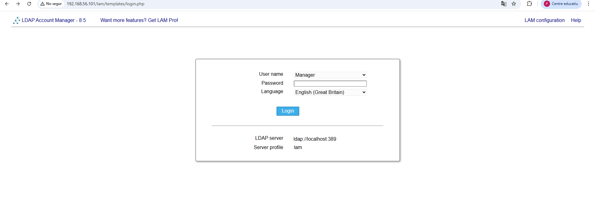

- Accedim a:
  **LAM Configuration → Edit server profiles**
  i entrem amb la contrasenya `lam`.


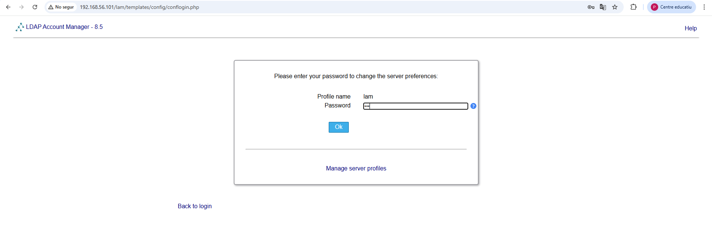

- Configurem els **paràmetres bàsics**: idioma, compte administrador, etc.

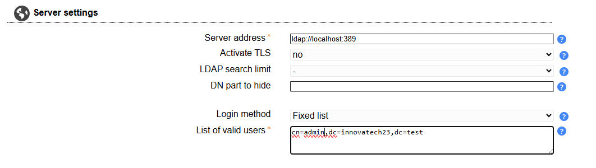
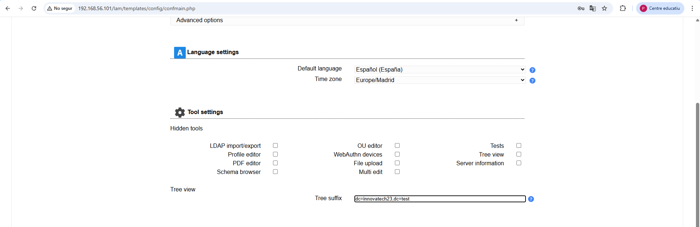
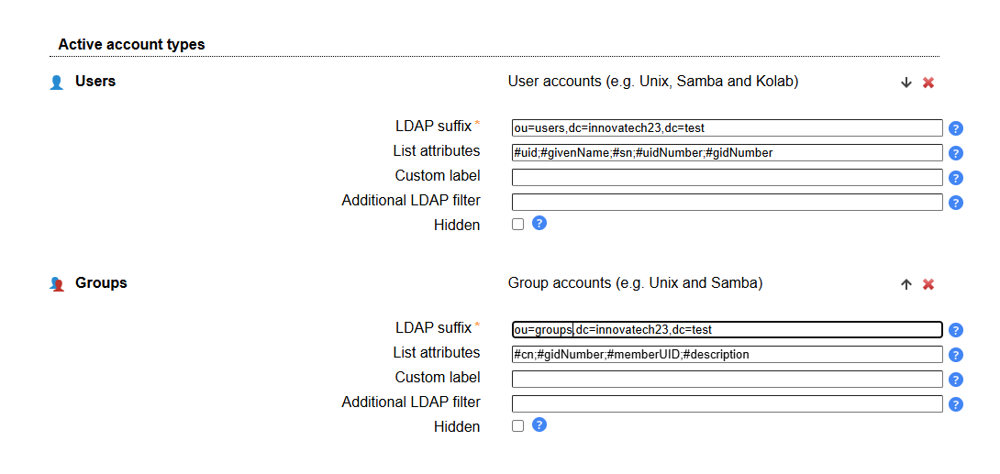

- Accedim al **directori LDAP**:

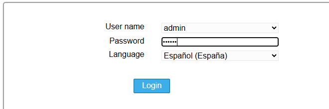

- Creem els **grups** `tech` i `manager`:

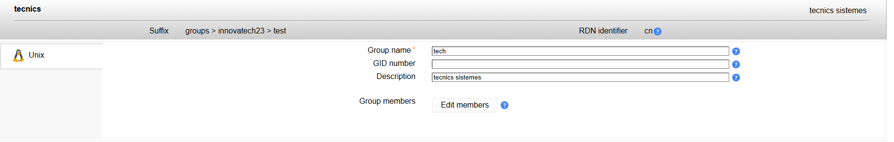
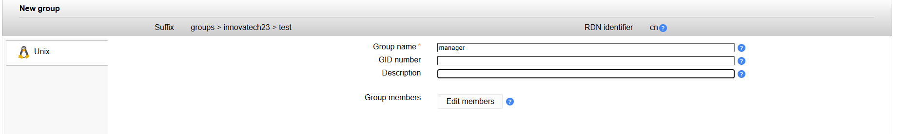
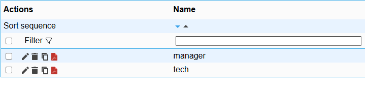

- Creem els **usuaris** `tech01` i `manager01`:

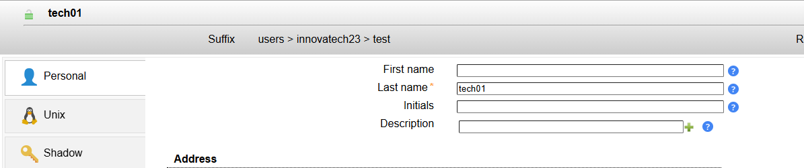
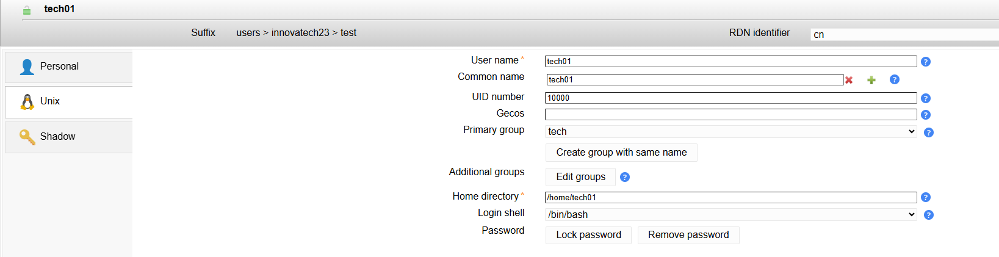
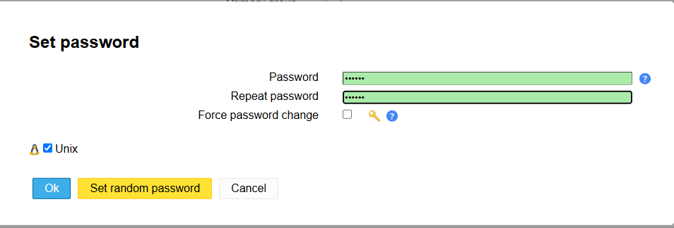
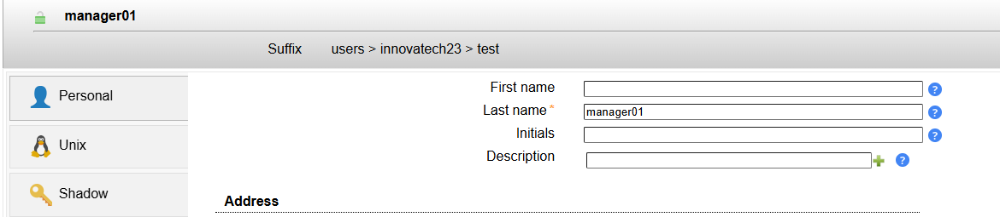
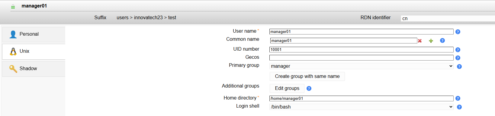
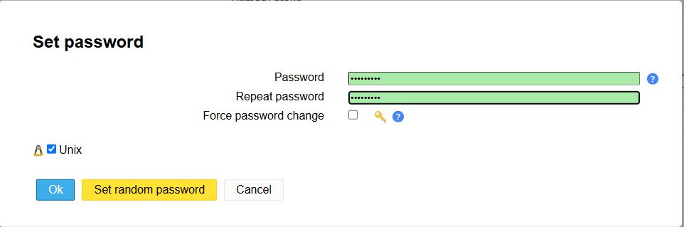

---

## 🔐 3. Autenticació utilitzant LDAP

- Configurem el **nom del client** per associar-lo al domini del directori, editant l’arxiu `/etc/hosts`:

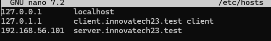

- Instal·lem els paquets necessaris:

```bash
sudo apt install libpam-ldap libnss-ldap nscd

```


- Realitzarem la **configuració del client LDAP**:

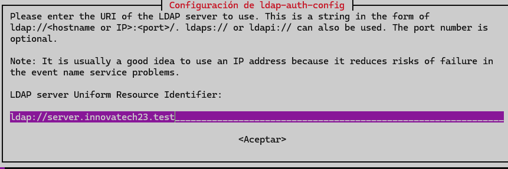

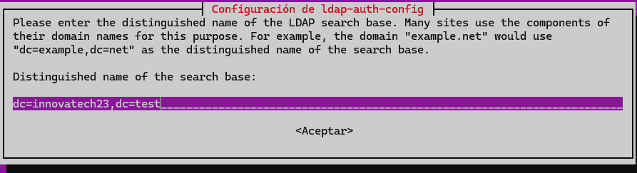

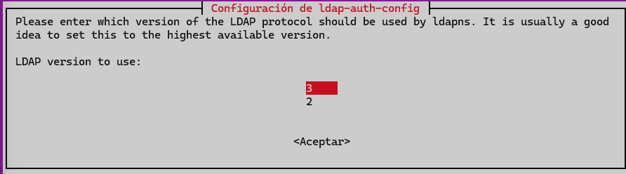

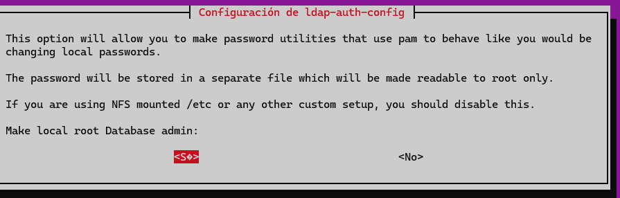

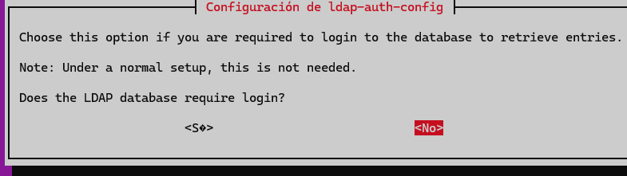

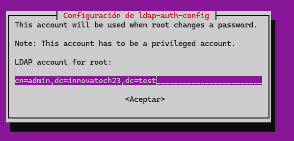

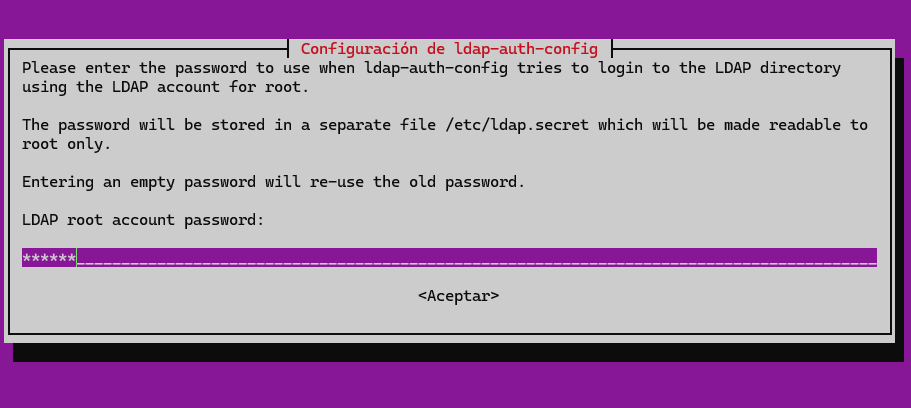

- Comprovem la **connexió entre el client i el servidor**:

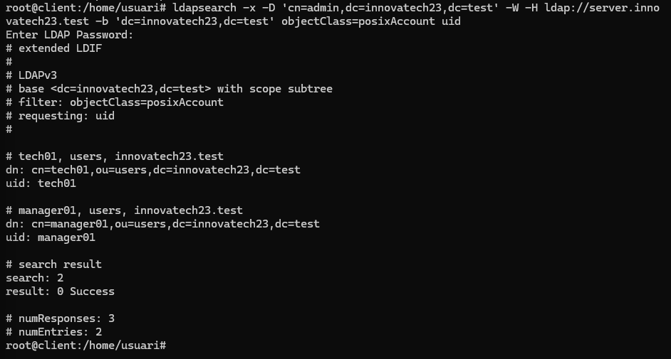

- Editem l’arxiu `/etc/nsswitch.conf` per indicar que s’utilitzarà LDAP per a usuaris i grups:

```bash

passwd:         files systemd ldap
group:          files systemd ldap
shadow:         files ldap
```
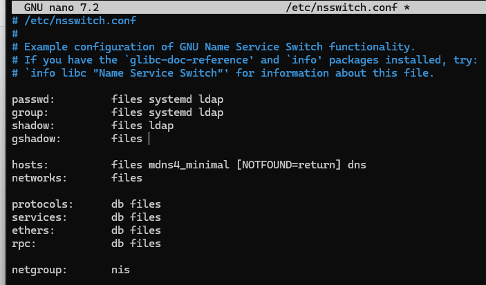

- Eliminem la línia `use_authtok ` de l’arxiu `/etc/pam.d/common-password`:


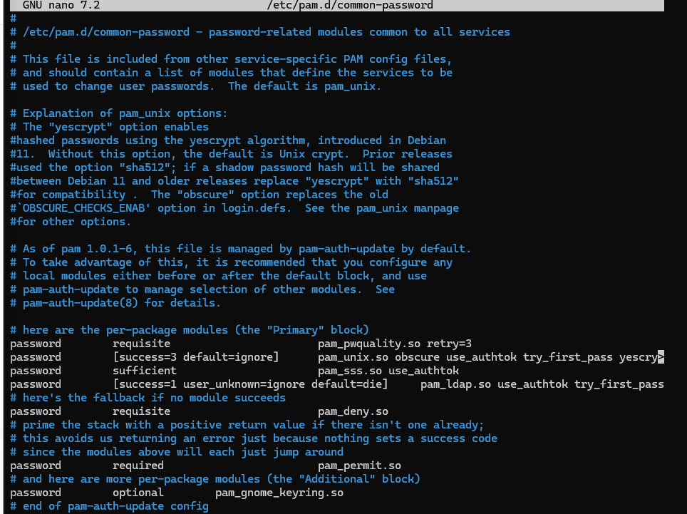

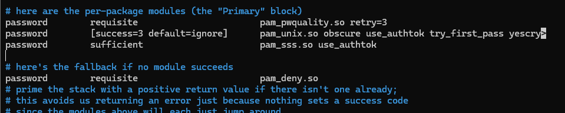

- Editem l’arxiu `/etc/pam.d/common-session` i afegim la línia següent per crear automàticament els directoris personals dels usuaris:

```bash
session required pam_mkhomedir.so skel=/etc/skel umask=0022
```
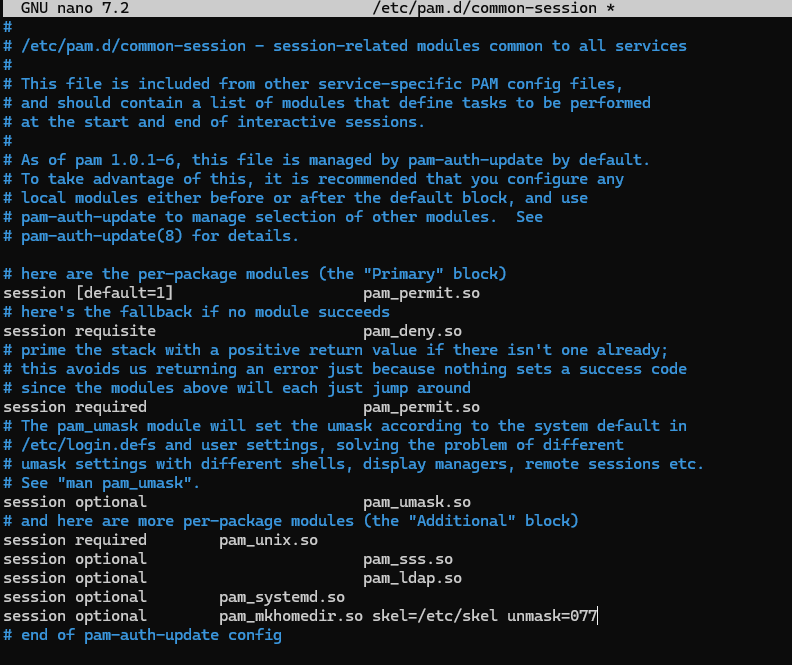

- Reiniciem el servei de memòria cau d’usuaris:


```bash
sudo sysstemctl restart nscd
```
- Comprovem que el sistema **detecta els usuaris LDAP**:
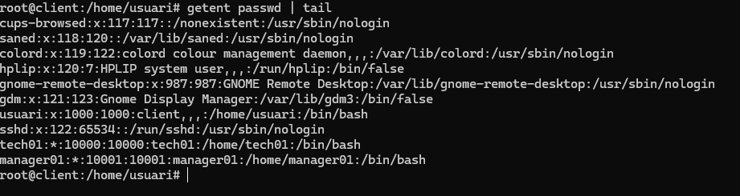

- Editem l’arxiu `/etc/pam.d/gdm-launch-environment` per assegurar l’autenticació gràfica:

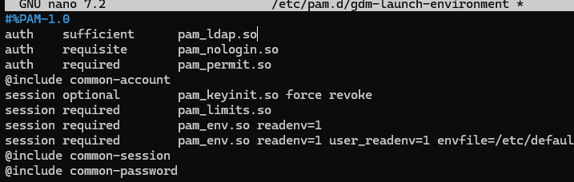

- Reiniciem el client i **iniciem sessió amb un usuari del directori** (`tech01`, per exemple):


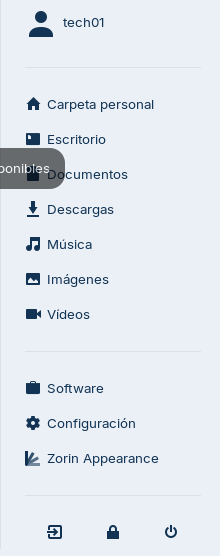

- Un cop iniciada la sessió, comprovem que:


  - S’ha creat la **carpeta personal de l’usuari**

  - L’usuari s’ha **autenticat correctament via LDAP**


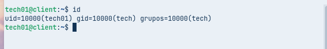

  
