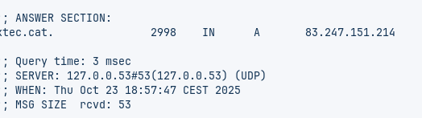
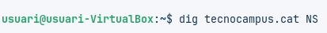
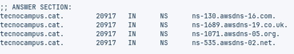
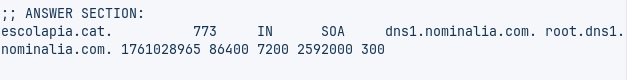
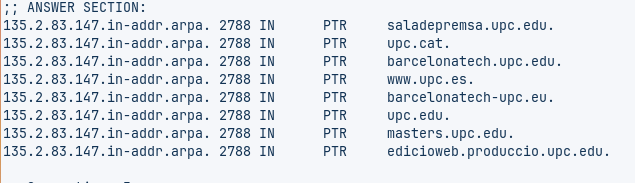
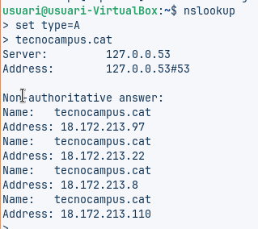
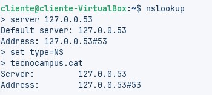
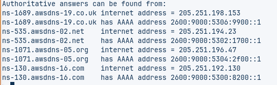
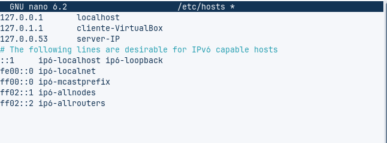
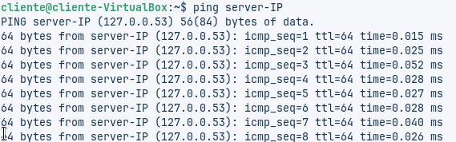

# T06: Fonaments del servei DNS

## A. Diagnosi Avançada amb `dig` (Linux / macOS)

### Comanda 1: Consulta Bàsica de Registre A

**Comanda:**
```bash
dig xtec.cat A
```


**Anàlisi:**  
- **IP de resposta:** [83.247.151.214]  
- **TTL:** [2998]  
- **Servidor que ha respost:** [127.0.0.53]



**Comanda:**
```bash
dig tecnocampus.cat NS
```


**Anàlisi:**  
- **Servidors de noms autoritatius:**  
  - [ns-130.awsdns-16.com.]  
  - [ns-1689.awsdns-19.co.uk.]  
  - [ns-1071.awsdns-05.org.]
  - [ns-535.awsdns-02.net.]



**Comanda:**  
```bash
dig escolapia.cat SOA
```


**Anàlisi:**  
- **Correu de l'administrador:** [root@dns1.nominalia.com]  
- **Número de sèrie del domini:** [1761028965]

**Captura:** 



**Comanda:**
```bash
dig -x 147.83.2.135
```


**Anàlisi:**  
- **Informació obtinguda:** Es tracta d’un registre PTR (Pointer Record), que s’utilitza en DNS invers per associar una IP amb un o més noms de domini.
En aquest cas, la IP 147.83.2.135 (es veu invertida com 135.2.83.147.in-addr.arpa) té associats diversos noms:

saladepremsa.upc.edu

upc.cat

barcelonatech.upc.edu

www.upc.es

barcelonatech.upc.eu

upc.edu

masters.upc.edu

edicioweb.produccio.upc.edu



---

## B. Comprovació de Resolució amb `nslookup` (Multiplataforma)

### Comanda 1: Consulta Bàsica no Autoritativa

**Comandes:**
```bash
nslookup
set type=A
tecnocampus.cat
 ```
 **Anàlisi:**
- La resposta és **no autoritativa** perquè prové d’un servidor de noms que no és autoritari per al domini consultat.
- Això significa que el servidor ha obtingut la informació d’un altre servidor i no és la font original.



---

## Comanda 2: Consulta Autoritativa

**Comandes:**
```bash
nslookup

server [IP del servidor NS autoritatiu obtingut amb dig]
set type=NS
tecnocampus.cat
```


**Anàlisi:**
- La resposta és **autoritativa** perquè prové directament d’un servidor de noms que gestiona el domini tecnocampus.cat.
- Les diferències respecte a la consulta anterior inclouen:
  - Informació més precisa i directa.
  - Possiblement més detalls en els registres.
  - Confirmació que el servidor és responsable del domini.



---

## C. Resolució Local

### Activitat: Comprovació del funcionament de la resolució local

La resolució local permet associar noms d’equip amb adreces IP dins d’una xarxa interna, sense necessitat de consultar un servidor DNS extern. Això és útil en entorns on no es disposa d’un servidor de noms propi.

#### Exemple de configuració

**Fitxer modificat:** 
```bash
/etc/hosts (en sistemes Linux/macOS)
```

**Entrada afegida:**
```bash
 127.0.0.53 server-IP
```


 #### Comanda de prova
 ```bash
 ping server-IP
 ```


 #### Anàlisi:
- Si la resolució local funciona correctament, el sistema reconeix el nom `server-IP` i l’associa a la IP `127.0.0.53`.
- No es fa cap consulta externa al DNS.
- És una solució ràpida i eficaç per a entorns petits o temporals.

 
